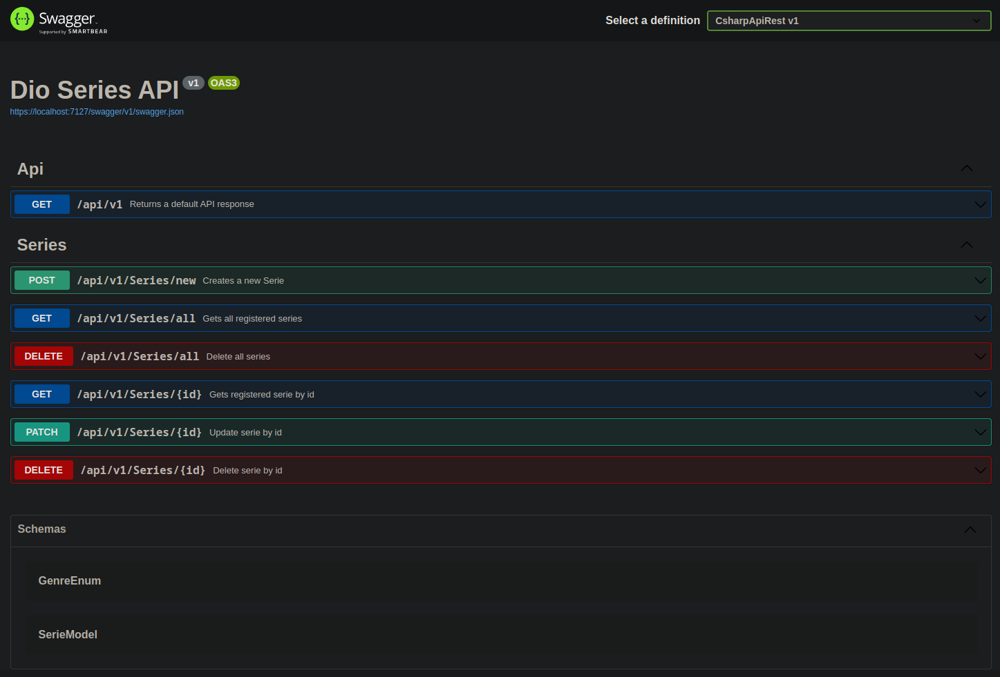

<div align="center">
    
    <h1>C# Coding Challenge</h1>
    <h2>DIO SERIES CRUD API</h2>
</div>

<br>
<br>

## This Project Contains:
- OOP
- Api Rest Foundations
- .NET 6
- ASP.NET Core

<br>

## Get it running:
On the project folder, run:

```dotnet run```

the following ports are going to be listened:
- for https: https://localhost:7127
- for http: http://localhost:5174

## Documentation links:
- for https: https://localhost:7127/swagger/index.html
- for http: http://localhost:5174/swagger/index.html

## Default Api links:
- for https: https://localhost:7127/api/v1/
- for http: http://localhost:5174/api/v1/

## Series Services links:
- for https: https://localhost:7127/api/v1/Series/
- for http: http://localhost:5174/api/v1/Series/


<br>
<br>

<div align="center">
    <h2>Api Swagger Documentation</h2>
    
</div>